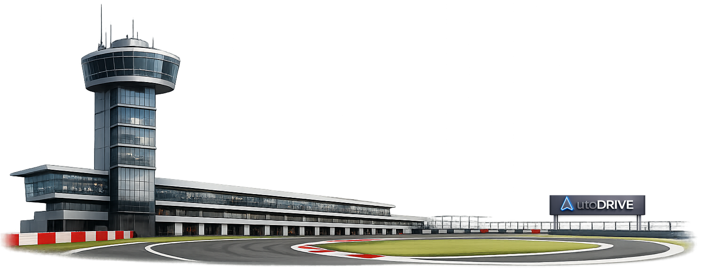
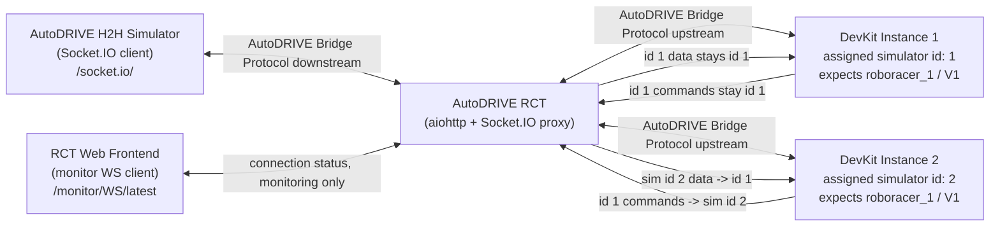
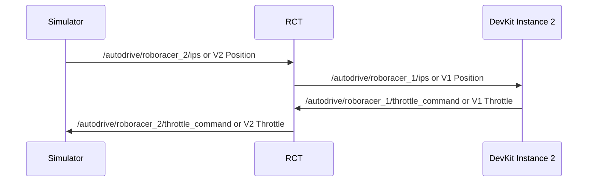

# AutoDRIVE Race Control Tower



AutoDRIVE Race Control Tower (RCT) is a Socket.IO-aware proxy for the AutoDRIVE RoboRacer H2H Simulator. It lets one simulator interact with two independent DevKit bridge instances without changing the existing AutoDRIVE bridge payload schema or the DevKit bridge code.



## Purpose

The stock DevKit bridge expects to control `roboracer_1`. In a head-to-head simulator run, each DevKit instance still receives vehicle data as `roboracer_1`, while RCT maps each connected DevKit instance to a simulator vehicle id:

- Simulator to DevKit: vehicle-specific data for the assigned simulator vehicle is rewritten to id `1`.
- DevKit to Simulator: commands produced by the DevKit for id `1` are rewritten back to the assigned simulator vehicle id.

Example mapping:

- Simulator data `/autodrive/roboracer_2/ips` is sent to DevKit 2 as `/autodrive/roboracer_1/ips`.
- DevKit 2 command `/autodrive/roboracer_1/throttle_command` is sent to the simulator as `/autodrive/roboracer_2/throttle_command`.
- AutoDRIVE bridge dictionary fields such as `V2 Position` are sent to DevKit 2 as `V1 Position`.
- DevKit 2 fields such as `V1 Throttle` are sent back to the simulator as `V2 Throttle`.



## Connection Model

- RCT HTTP frontend: `http://<rct-host>:4567/`
- AutoDRIVE Simulator Socket.IO client: `ws://<rct-host>:4567/socket.io/?EIO=4&transport=websocket`
- RCT monitor REST endpoint: `http://<rct-host>:4567/monitor/REST/latest`
- RCT browser monitor client: `ws://<rct-host>:4567/monitor/WS/latest`
- DevKit upstream 1: configured by `RCT_DEVKIT_URLS`
- DevKit upstream 2: configured by `RCT_DEVKIT_URLS`

By default, DevKit 1 is assigned simulator vehicle id `1` and DevKit 2 is assigned simulator vehicle id `2`.

When a simulator connects to RCT through Socket.IO, RCT starts connecting to the configured DevKit bridge instances as Socket.IO clients. DevKit URLs can be configured with `ws://`, `wss://`, `http://`, or `https://`; RCT normalizes `ws://` to `http://` and `wss://` to `https://` for `python-socketio` while still forcing the WebSocket transport.


## Requirements

- Python 3.12+
- `aiohttp`
- `python-socketio`
- Docker, optional

## Install

```bash
python3 -m pip install -r requirements.txt
```

The host workspace does not provide `pip` or `ensurepip`, so the freeze was verified inside the Docker image. The resulting `pip freeze` output is:

```text
aiohappyeyeballs==2.6.1
aiohttp==3.13.5
aiosignal==1.4.0
attrs==26.1.0
frozenlist==1.8.0
idna==3.11
multidict==6.7.1
propcache==0.4.1
python-engineio==3.13.0
python-socketio==4.2.0
six==1.17.0
typing_extensions==4.15.0
yarl==1.23.0
```

## Run Locally

```bash
export RCT_DEVKIT_URLS="ws://127.0.0.1:4568,ws://127.0.0.1:4569"
export RCT_DEVKIT_VEHICLE_IDS="1,2"
python3 -m rct
```

Environment variables:

| Name | Default | Description |
| --- | --- | --- |
| `RCT_HOST` | `0.0.0.0` | RCT HTTP/Socket.IO bind host |
| `RCT_PORT` | `4567` | RCT HTTP/Socket.IO port |
| `RCT_DEVKIT_URLS` | `ws://127.0.0.1:4568,ws://127.0.0.1:4569` | Comma-separated DevKit slots created at startup. The active host/port is supplied by the frontend |
| `RCT_DEVKIT_VEHICLE_IDS` | `1,2,...` | Comma-separated simulator vehicle ids assigned to each DevKit URL |
| `RCT_RECONNECT_DELAY_SECONDS` | `3.0` | Delay before reconnecting to a DevKit endpoint |
| `RCT_MAX_MESSAGE_SIZE` | `16777216` | Maximum HTTP/WebSocket message size. Use `0` or less for no limit |
| `RCT_CLIENT_QUEUE_SIZE` | `256` | Outbound queue size per DevKit connection |
| `RCT_PING_INTERVAL_SECONDS` | `20` | Socket.IO ping interval |
| `RCT_PING_TIMEOUT_SECONDS` | `20` | Socket.IO ping timeout |
| `RCT_DEBUG_ENGINEIO_MESSAGES` | `false` | Log raw Engine.IO message packets for compatibility debugging |
| `RCT_DEBUG_ENGINEIO_MAX_CHARS` | `2000` | Maximum raw Engine.IO packet preview length |
| `RCT_DEBUG_SOCKETIO_CLIENT` | `false` | Enable python-socketio client logs for DevKit connections |
| `RCT_DEBUG_ENGINEIO_CLIENT` | `false` | Enable python-engineio client logs for DevKit connections, including ping/pong and transport close details |
| `RCT_DEBUG_SOCKETIO_SERVER` | `false` | Enable python-socketio server logs for simulator connections |
| `RCT_DEBUG_ENGINEIO_SERVER` | `false` | Enable python-engineio server logs for simulator connections |
| `RCT_DEBUG_BRIDGE_FLOW` | `false` | Log compact ANSI-colored Bridge flow timeline |
| `RCT_LOG_BRIDGE_MESSAGES` | `false` | Pretty-print incoming simulator `Bridge` events with LIDAR/camera values omitted |
| `RCT_LOG_BRIDGE_MAX_CHARS` | `20000` | Maximum pretty-printed `Bridge` payload length |

## Frontend

Run RCT, then open `http://localhost:4567/` in a browser. RCT serves `frontend/index.html` and static assets from the bundled `frontend` directory. The page uses Bootstrap and connects to the monitor WebSocket endpoint for RCT connection state.

The frontend sends the Roboracer 1 and 2 hostname/port fields to RCT when the monitor WebSocket connects. RCT stores those endpoints and connects configured/enabled DevKit bridge instances when the simulator connects. The Roboracer connected/disconnected buttons can also manually connect or disconnect each DevKit bridge instance.

## Monitor Protocol

The browser frontend talks to the RCT server through AutoDRIVE RCT Monitor Protocol. Current version is `0.1`; `latest` is an alias for `0.1`.

- REST state endpoint: `/monitor/REST/latest`
- WebSocket event endpoint: `/monitor/WS/latest`

See `docs/monitor-protocol.md` for the protocol structure and planned command/event surfaces.

REST monitor snapshots and WS monitor events are backed by the same in-process `RaceControlState`. Monitor WS fanout is handled separately by `MonitorEventHub`, so state updates are kept separate from network sends.

## Docker

Build the image:

```bash
docker build -t autodrive-rct .
```

Run the container:

```bash
docker run --rm \
  -p 4567:4567 \
  -e RCT_DEVKIT_URLS="ws://host.docker.internal:4568,ws://host.docker.internal:4569" \
  -e RCT_DEVKIT_VEHICLE_IDS="1,2" \
  autodrive-rct
```

On Linux, add `--add-host=host.docker.internal:host-gateway` if `host.docker.internal` is not available, or place RCT and the DevKit instances on the same Docker network.

The bundled `./run.sh` script builds `autodrive-rct:dev` from the current workspace before running it. It uses Docker host networking, bind mounts the host `frontend` directory into `/app/frontend`, and defaults DevKit URLs to `ws://127.0.0.1:4568,ws://127.0.0.1:4569`.

## Frontend Command Format

The bundled frontend does not send commands by default. For manual testing, the browser monitor socket can send JSON commands:

```javascript
socket.send(JSON.stringify({
  target: "devkit:2",
  event: "message",
  payload: { "V2 Position": "1.0 2.0 0.0" }
}));
```

Supported targets:

- `simulator`
- `all-devkits`
- `devkit:1`
- `devkit:2`

When targeting DevKit connections, RCT applies the same simulator-to-DevKit id rewrite before sending the payload upstream as a Socket.IO event.

## Protocol Notes

RCT handles both common AutoDRIVE id forms:

- ROS-style strings containing `roboracer_<id>`, such as `/autodrive/roboracer_2/ips`
- DevKit bridge dictionary fields using `V<id> ` prefixes, such as `V2 LIDAR Range Array`

Binary payload values are forwarded without id rewriting. Use text, dict, or list payloads when id rewriting is required.

The AutoDRIVE simulator and public RoboRacer DevKit bridge use Socket.IO over WebSocket transport. RCT uses `aiohttp` for HTTP/static/monitor routes and `python-socketio` for simulator and DevKit bridge sessions.

## License

This project is licensed under the BSD 3-Clause License. See `LICENSE`.
